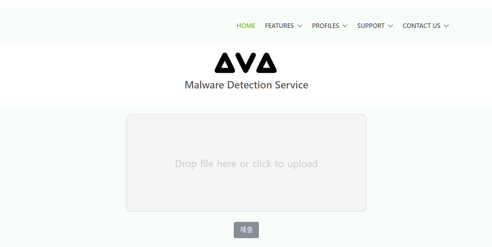
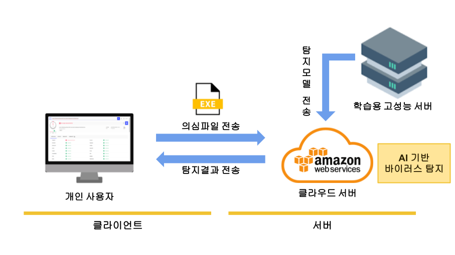
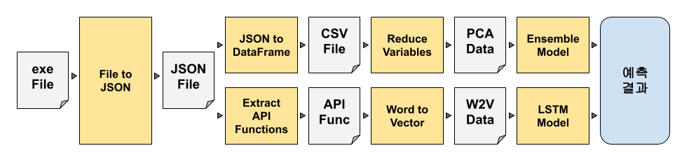
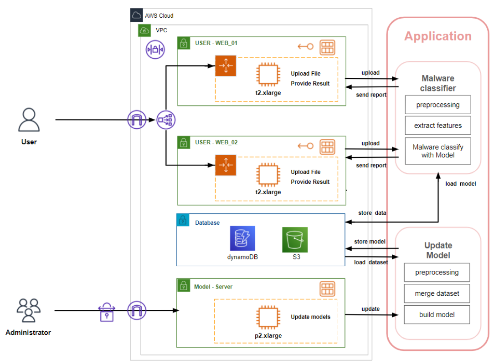

# AI Anti-Virus Program
임시 작성 중입니다. (완료예정일 : 2021.12.22)

## 프로그램 개요

AI Anti-Virus 프로그램을 이용하여 악성코드로부터의 위협을 차단합니다.  
의심 파일에 대하여 바이러스 검사를 수행하면, 탐지 모델을 이용하여 95% 이상의 정확도로 바이러스를 탐지합니다.

AI 안티 바이러스 프로그램 개발 중입니다.  
현재 보이는 내용은 임시로 작성된 것입니다.  

___
## 사용 방법

`http://3.28.102.197:5021/ (프로토타입)`에 접속하여 사용합니다.  

___
## 예측 모델

예측 모델은 다음 그림과 같이 구성되어 있습니다.

수집된 데이터는 JSON 형식으로 변환되며, 이 파일을 이용하여 다방면으로 분석합니다.
각각의 분석 모델 수행 후 결과를 종합하여 파일이 바이러스 파일인지 아닌지 검사합니다.

___
## 시스템 아키텍처

프로그램의 서버는 AWS의 EC2, S3, DynamoDB를 이용하였습니다.  
