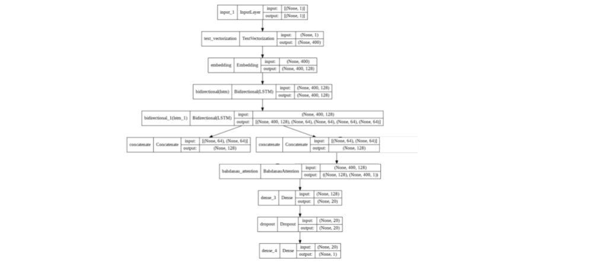

# AI 바이러스 스캐너

## 개요

---

사용자가 악성 파일 여부 검사를 요청하면 클라우드 서버(AWS)에서 머신러닝 기법으로 예측하여 결과를 출력합니다.

## 프로젝트 산출물

---

프로젝트 종료(2021.12.22) 이후 지원받은 AWS 계정 회수로 인하여 **운영 불가**

## 팀 구성 및 역할

---

## 개발 환경

---

- Language : Python
- Web Framework : Flask
- ML Framework : Tensor Flow, Keras
- Front-End Framework : Bootstrap
- OS: Linux (Ubuntu 18.04)
- Deploy : AWS (EC2, Dynamo DB, S3)
- File Parsing : LIEF
- Collaboration : Github (Source Tree)

## 시스템 아키텍처

---

- 모델 서버와 웹 서버 분리하여 운영
- 로드밸런서, 오토스케일링 적용

## 분석 결과

---

- 데이터 형식별 두 가지 모델 동시 적용
    - 수치 데이터(general, header, section)는 **앙상블 모델** 적용
    - 문자열 리스트 데이터(API functions)는 **LSTM 모델** 적용

---

- Pycaret을 이용한 Auto ML 기법 적용
- Random Forest, Extra Trees, KNN 모델을 Hard Voting 방식으로 앙상블
- 모델 정확도 **95.65%**

---

Bidirectional LSTM, Bahdanau Attention 등을 참고하여 모델 생성

모델 정확도 : 94.75%

---

[GitHub - kimnamjun/AI-Anti-Virus-Program](https://github.com/kimnamjun/AI-Anti-Virus-Program)
